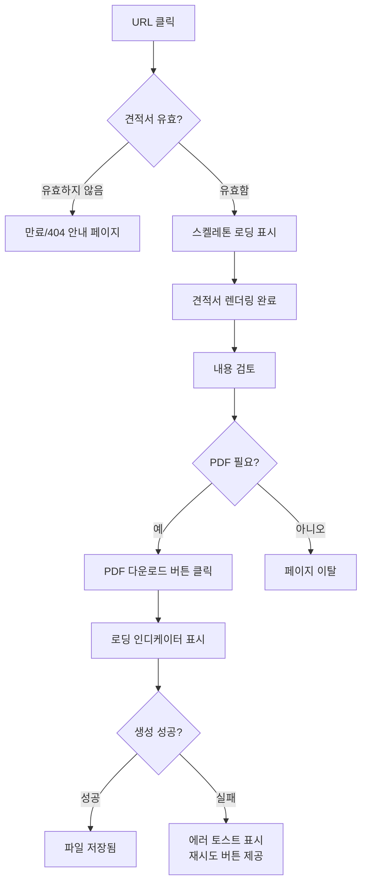

# PRD: 노션 기반 견적서 웹 뷰어 & PDF 다운로드

**버전**: 1.0.0
**작성일**: 2026-04-18
**상태**: 초안

---

## 1. 개요 (Overview)

**제품 한 줄 설명**
노션에 작성된 견적서를 클라이언트 전용 URL로 공유하고, 브랜드된 UI로 확인하며 PDF로 다운로드할 수 있는 견적서 공유 서비스.

**핵심 가치 제안 (Value Proposition)**

| # | 가치 | 설명 |
|---|------|------|
| 1 | 즉시 공유 | 노션에서 작성 후 URL 하나로 클라이언트에게 전달, 별도 파일 첨부 불필요 |
| 2 | 전문적인 외관 | 노션 기본 UI 대신 브랜드 일관성이 있는 전용 페이지로 신뢰도 향상 |
| 3 | 원클릭 PDF | 클라이언트가 버튼 하나로 고품질 PDF 저장, 인쇄 가능 |

**대상 사용자**

- **프라이머리**: 프리랜서 개발자/디자이너, 소규모 에이전시 — 노션으로 견적서를 관리하고 클라이언트에게 공유하는 사람
- **세컨더리**: 클라이언트(발주사 담당자) — 견적서를 확인하고 내부 결재를 위해 PDF가 필요한 사람

---

## 2. 목표 및 성공 지표 (Goals & Success Metrics)

### MVP 목표

| 목표 | 측정 기준 | 목표값 |
|------|-----------|--------|
| 견적서 웹 렌더링 | 노션 데이터 → 웹 페이지 정상 표시 | 100% 필드 매핑 성공 |
| PDF 생성 안정성 | PDF 다운로드 성공률 | ≥ 95% |
| 페이지 로드 성능 | 초기 로드 시간 (Vercel Edge) | ≤ 2초 |
| 한글 렌더링 | PDF 내 한글 깨짐 없음 | 0건 |
| URL 보안 | 미인가 접근 차단 | 100% |

### MVP 범위 밖 (Out of Scope)

- 견적서 승인/반려 워크플로우
- 전자 서명 기능
- 다국어(영어 외) PDF 템플릿
- 결제 연동
- 견적서 자동 발송(이메일/슬랙)
- 노션 외 데이터 소스 지원

---

## 3. 사용자 스토리 (User Stories)

### 관리자 (견적서를 노션에 입력하는 사람)

**US-A1**
> As an admin, I want to create an invoice in Notion and get a shareable URL automatically, so that I can send it to clients without any extra steps.

**수용 기준**
- 노션 데이터베이스에 견적서 레코드 생성 시 고유 `invoiceId`가 자동 할당된다.
- `/invoice/[invoiceId]` URL이 즉시 접근 가능하다.
- URL이 만료 전인 경우 인증 없이 열람 가능하다.

---

**US-A2**
> As an admin, I want to set an expiration date on an invoice, so that clients cannot view it after the validity period ends.

**수용 기준**
- 노션의 `expiresAt` 필드에 날짜를 지정할 수 있다.
- 만료일 이후 URL 접근 시 "견적서가 만료되었습니다" 안내 페이지가 표시된다.
- 만료된 견적서는 PDF 다운로드도 비활성화된다.

---

**US-A3**
> As an admin, I want to see whether a client has viewed the invoice, so that I can follow up if they haven't opened it.

**수용 기준**
- 클라이언트가 견적서 URL 접속 시 조회 로그(타임스탬프, IP 해시)가 기록된다.
- 노션 데이터베이스의 `viewCount` 필드가 업데이트된다.
- 관리자는 노션에서 조회 여부를 확인할 수 있다.

---

### 클라이언트 (웹에서 견적서를 확인하는 사람)

**US-C1**
> As a client, I want to view the invoice clearly on any device, so that I can review it without needing a Notion account.

**수용 기준**
- 모바일(375px), 태블릿(768px), 데스크탑(1280px) 해상도에서 레이아웃이 깨지지 않는다.
- 노션 계정 없이 URL 접속만으로 전체 내용을 볼 수 있다.
- 견적 항목, 금액 합계, 공급자 정보가 모두 표시된다.

---

**US-C2**
> As a client, I want to download the invoice as a PDF, so that I can submit it for internal approval.

**수용 기준**
- "PDF 다운로드" 버튼 클릭 시 파일 다운로드가 시작된다.
- 다운로드된 PDF 파일명은 `견적서_[프로젝트명]_[날짜].pdf` 형식이다.
- PDF 내 한글이 정상적으로 출력된다.
- PDF 생성 시간이 5초를 넘지 않는다.

---

**US-C3**
> As a client, I want to see a clear error message if the invoice is unavailable, so that I know to contact the sender.

**수용 기준**
- 존재하지 않는 ID 접근 시 404 안내 메시지와 담당자 연락처가 표시된다.
- 만료된 견적서 접근 시 만료 날짜와 재문의 안내가 표시된다.
- 로딩 중 스켈레톤 UI가 표시되어 콘텐츠 이동(layout shift)이 없다.

---

## 4. 기능 요구사항 (Functional Requirements)

| 우선순위 | 기능 ID | 기능명 | 설명 |
|----------|---------|--------|------|
| P0 | F-01 | 노션 데이터 조회 | Notion API로 견적서 DB에서 단건 조회 |
| P0 | F-02 | 견적서 웹 렌더링 | `/invoice/[id]`에서 브랜드 UI로 렌더링 |
| P0 | F-03 | PDF 다운로드 | 버튼 클릭 → PDF 생성 → 파일 저장 |
| P1 | F-04 | 만료 처리 | 유효기간 초과 시 접근 차단 및 안내 |
| P1 | F-05 | 로딩/에러 상태 UI | Skeleton, Error, Empty State 컴포넌트 |
| P1 | F-06 | 한글 폰트 임베딩 | PDF에 Noto Sans KR 폰트 포함 |
| P2 | F-07 | 조회 로그 기록 | 접속 시 타임스탬프/IP 해시 저장 |
| P2 | F-08 | 노션 viewCount 업데이트 | 조회 시 노션 필드 자동 갱신 |

---

## 5. 비기능 요구사항 (Non-Functional Requirements)

### 성능

| 항목 | 목표 |
|------|------|
| 초기 페이지 로드 (LCP) | ≤ 2.0초 (Vercel Edge, ISR 캐시 히트 기준) |
| PDF 생성 시간 | ≤ 5.0초 |
| Notion API 응답 캐싱 TTL | 60초 (ISR revalidate) |

### 보안

- 견적서 URL은 추측 불가능한 UUID v4 또는 HMAC 서명 토큰 사용
- Notion API 키는 서버 환경변수에만 저장, 클라이언트에 노출 금지
- PDF 생성 엔드포인트는 서버사이드에서만 실행

### 접근성 (WCAG 2.1 AA)

- 색상 대비 비율 ≥ 4.5:1
- 키보드 네비게이션 지원 (Tab, Enter)
- PDF 다운로드 버튼에 `aria-label` 제공
- 이미지 요소에 `alt` 텍스트 필수

### 반응형

| 브레이크포인트 | 범위 | 레이아웃 |
|---------------|------|---------|
| Mobile | 375px ~ 767px | 단일 컬럼, 스크롤 |
| Tablet | 768px ~ 1279px | 2컬럼 (정보 + 항목표) |
| Desktop | 1280px~ | 고정폭(800px) 중앙 정렬 |

---

## 6. 데이터 모델 (Data Model)

### 노션 데이터베이스 스키마

**Invoice 테이블**

| 필드명 | 노션 타입 | 설명 |
|--------|-----------|------|
| `title` | Title | 견적서 제목 (프로젝트명) |
| `invoiceNumber` | Rich Text | 견적서 번호 (예: INV-2026-001) |
| `status` | Select | `draft` / `sent` / `expired` |
| `issuedAt` | Date | 발행일 |
| `expiresAt` | Date | 유효기간 만료일 |
| `clientName` | Rich Text | 클라이언트 회사명 |
| `clientEmail` | Email | 클라이언트 이메일 |
| `vendorName` | Rich Text | 공급자명 |
| `vendorContact` | Rich Text | 공급자 연락처 |
| `lineItems` | Relation | 견적 항목 테이블과 연결 |
| `totalAmount` | Formula | 자동 계산 합계 |
| `currency` | Select | `KRW` / `USD` |
| `notes` | Rich Text | 특이사항 |
| `viewCount` | Number | 조회 횟수 (P2) |
| `lastViewedAt` | Date | 마지막 조회일 (P2) |

**LineItem 테이블**

| 필드명 | 노션 타입 | 설명 |
|--------|-----------|------|
| `description` | Title | 항목명 |
| `quantity` | Number | 수량 |
| `unitPrice` | Number | 단가 |
| `amount` | Formula | `quantity × unitPrice` |
| `invoice` | Relation | Invoice 테이블 역참조 |

### TypeScript 인터페이스 (`src/types/invoice.ts`)

```typescript
export type InvoiceStatus = 'draft' | 'sent' | 'expired';
export type Currency = 'KRW' | 'USD';

export interface LineItem {
  id: string;
  description: string;
  quantity: number;
  unitPrice: number;
  amount: number;
}

export interface Invoice {
  id: string;
  invoiceNumber: string;
  title: string;
  status: InvoiceStatus;
  issuedAt: string;       // ISO 8601
  expiresAt: string | null;
  clientName: string;
  clientEmail: string;
  vendorName: string;
  vendorContact: string;
  lineItems: LineItem[];
  totalAmount: number;
  currency: Currency;
  notes: string | null;
}

export interface InvoiceViewLog {
  invoiceId: string;
  viewedAt: string;
  ipHash: string;
}
```

---

## 7. API 설계 (API Design)

### `GET /api/invoices/[id]`

견적서 단건 조회. 노션 API 호출 후 정규화된 `Invoice` 객체 반환.

**응답 (200 OK)**
```json
{
  "data": {
    "id": "abc-123",
    "invoiceNumber": "INV-2026-001",
    "status": "sent",
    "clientName": "ACME Corp",
    ...
  }
}
```

**에러 응답**

| 상태 코드 | 코드 | 설명 |
|-----------|------|------|
| 404 | `INVOICE_NOT_FOUND` | 해당 ID 없음 |
| 410 | `INVOICE_EXPIRED` | 유효기간 만료 |
| 500 | `NOTION_API_ERROR` | 노션 API 오류 |

```typescript
// src/app/api/invoices/[id]/route.ts
export type ApiResponse<T> =
  | { data: T }
  | { error: { code: string; message: string } };
```

---

### `GET /api/invoices/[id]/pdf`

PDF 바이너리 스트림 반환.

**응답 헤더**
```
Content-Type: application/pdf
Content-Disposition: attachment; filename="견적서_프로젝트명_20260418.pdf"
```

**에러 응답**

| 상태 코드 | 코드 | 설명 |
|-----------|------|------|
| 404 | `INVOICE_NOT_FOUND` | 해당 ID 없음 |
| 410 | `INVOICE_EXPIRED` | 만료된 견적서 |
| 500 | `PDF_GENERATION_FAILED` | PDF 생성 실패 |

---

## 8. 페이지 및 컴포넌트 구조 (Page & Component Architecture)

### 페이지 라우팅

| 경로 | 파일 | 설명 |
|------|------|------|
| `/invoice/[id]` | `src/app/invoice/[id]/page.tsx` | 견적서 뷰어 (SSR) |
| `/invoice/[id]/expired` | `src/app/invoice/[id]/expired/page.tsx` | 만료 안내 페이지 |
| `/invoice/not-found` | `src/app/invoice/not-found/page.tsx` | 404 안내 페이지 |

### 컴포넌트 트리

```
InvoicePage (src/app/invoice/[id]/page.tsx)
└── InvoiceViewer (src/components/invoice/InvoiceViewer.tsx)
    ├── InvoiceHeader          # 견적서 번호, 발행일, 상태 배지
    ├── VendorClientInfo       # 공급자 ↔ 클라이언트 정보 (2컬럼)
    ├── LineItemTable          # 견적 항목 테이블
    │   └── LineItemRow        # 항목 행 (설명, 수량, 단가, 금액)
    ├── InvoiceSummary         # 소계, 세금, 합계
    ├── InvoiceNotes           # 특이사항 (optional)
    └── PDFDownloadButton      # PDF 다운로드 트리거
```

### 컴포넌트 Props 인터페이스

```typescript
// InvoiceViewer
interface InvoiceViewerProps {
  invoice: Invoice;
}

// LineItemTable
interface LineItemTableProps {
  items: LineItem[];
  currency: Currency;
}

// PDFDownloadButton
interface PDFDownloadButtonProps {
  invoiceId: string;
  fileName: string;
  disabled?: boolean;
}

// InvoiceSummary
interface InvoiceSummaryProps {
  totalAmount: number;
  currency: Currency;
  taxRate?: number; // 기본값: 0.1 (10%)
}
```

---

## 9. UX 플로우 (UX Flow)

### 관리자 플로우

```mermaid
flowchart TD
    A[노션 견적서 DB에 레코드 작성] --> B[필수 필드 입력\n항목, 금액, 클라이언트 정보]
    B --> C[expiresAt 날짜 설정]
    C --> D[레코드 ID 복사]
    D --> E[URL 조합: /invoice/{id}]
    E --> F[클라이언트에게 URL 전달\n이메일/메신저]
    F --> G{클라이언트 열람?}
    G -- 조회 완료 --> H[노션 viewCount 증가]
    G -- 미열람 --> I[후속 연락]
```

### 클라이언트 플로우



---

## 10. 기술 결정 사항 (Technical Decisions)

### PDF 생성 방식 비교

| 방식 | 장점 | 단점 | 권장 |
|------|------|------|------|
| `@react-pdf/renderer` | 서버/클라이언트 모두 가능, Vercel 친화적 | CSS 표현력 제한, 한글 폰트 직접 임베딩 필요 | **권장** |
| `puppeteer` | 실제 브라우저 렌더링, CSS 완전 지원 | Vercel 함수 크기 제한(50MB) 초과 위험, 실행 시간 길다 | 미권장 |
| `react-pdf` (구버전) | 간단한 API | 유지보수 중단, 타입 지원 미흡 | 미권장 |

**결정**: `@react-pdf/renderer` 사용. `public/fonts/NotoSansKR-Regular.ttf`를 포함해 한글 폰트 문제 해결.

---

### 노션 데이터 캐싱 전략

| 전략 | 장점 | 단점 |
|------|------|------|
| ISR (`revalidate: 60`) | 빠른 응답, Vercel 캐시 활용 | 최대 60초 데이터 지연 |
| 온디맨드 재검증 | 즉시 반영 가능 | 웹훅 설정 필요 (노션은 웹훅 미지원) |
| 클라이언트 페칭 | 항상 최신 데이터 | 초기 로드 느림, SEO 불리 |

**결정**: ISR (`revalidate: 60`) 사용. 견적서는 실시간성보다 안정성이 중요하며, 60초 지연은 허용 범위.

---

### 견적서 URL 보안

| 방식 | 장점 | 단점 |
|------|------|------|
| UUID v4 | 구현 단순 | 토큰 탈취 시 만료 전 영구 접근 |
| HMAC 서명 토큰 | 만료 시간 포함 가능, 서버 검증 | 구현 복잡도 증가 |

**결정**: MVP는 **UUID v4** 사용. 노션의 페이지 ID를 그대로 활용하면 구현이 단순하며, 만료일(`expiresAt`) 필드로 접근을 제어해 보안 수준 충족.

---

## 11. 구현 로드맵 (Implementation Roadmap)

### Sprint 1 — 노션 연동 + 기본 렌더링 (1주차)

| 작업 | 파일 |
|------|------|
| Notion API 클라이언트 설정 | `src/lib/notion.ts` |
| Invoice 타입 정의 | `src/types/invoice.ts` |
| 노션 응답 → Invoice 변환 함수 | `src/lib/notion-mapper.ts` |
| `GET /api/invoices/[id]` Route Handler | `src/app/api/invoices/[id]/route.ts` |
| InvoiceViewer 컴포넌트 구현 | `src/components/invoice/` |
| `/invoice/[id]` 페이지 구현 | `src/app/invoice/[id]/page.tsx` |
| 로딩/에러/만료 상태 UI | 각 page.tsx + 컴포넌트 |

**Definition of Done**: 노션에 테스트 레코드 생성 후 `/invoice/[id]`에서 모든 필드가 정상 표시된다.

---

### Sprint 2 — PDF 생성 + 스타일링 (2주차)

| 작업 | 파일 |
|------|------|
| `@react-pdf/renderer` 설치 및 폰트 설정 | `src/lib/pdf/` |
| InvoicePDFTemplate 컴포넌트 | `src/components/invoice/InvoicePDFTemplate.tsx` |
| `GET /api/invoices/[id]/pdf` Route Handler | `src/app/api/invoices/[id]/pdf/route.ts` |
| PDFDownloadButton 컴포넌트 | `src/components/invoice/PDFDownloadButton.tsx` |
| 반응형 스타일링 완성 | globals.css + 컴포넌트 |
| Noto Sans KR 폰트 파일 추가 | `public/fonts/` |

**Definition of Done**: PDF 다운로드 버튼 클릭 시 한글이 깨지지 않는 PDF가 5초 이내에 생성된다.

---

### Sprint 3 — 보안 + 에러 처리 + 배포 (3주차)

| 작업 | 파일 |
|------|------|
| 만료일 검증 미들웨어 | `src/middleware.ts` |
| 조회 로그 기록 (P2) | `src/lib/view-logger.ts` |
| 노션 viewCount 업데이트 (P2) | `src/lib/notion.ts` |
| 환경변수 설정 | `.env.local`, Vercel 설정 |
| Vercel 배포 및 도메인 연결 | — |
| E2E 시나리오 수동 테스트 | — |

**Definition of Done**: 프로덕션 URL에서 전체 플로우(노션 입력 → 웹 확인 → PDF 다운로드)가 정상 동작한다.

---

## 12. 리스크 및 가정 (Risks & Assumptions)

### 기술 리스크

| 리스크 | 가능성 | 영향 | 완화 전략 |
|--------|--------|------|-----------|
| **노션 API 레이트 리밋** (초당 3요청) | 중 | 중 | ISR 캐싱으로 API 호출 최소화. 동시 접속자가 많을 경우 Redis 캐시 레이어 추가 고려 |
| **PDF 한글 폰트 미표시** | 높음 | 높음 | `@react-pdf/renderer`에 Noto Sans KR TTF를 직접 임베딩. Sprint 1에서 선행 검증 |
| **Vercel 함수 실행 시간 초과** (기본 10초) | 낮음 | 높음 | PDF 생성 함수에 `maxDuration: 30` 설정. 복잡한 견적서는 스트리밍 응답으로 전환 |

### 비즈니스 가정

| 가정 | 근거 |
|------|------|
| 사용자는 이미 노션을 사용하고 있으며, Notion API 통합을 직접 설정할 수 있다 | 초기 타겟이 개발자/에이전시 |
| 견적서 1건당 견적 항목은 최대 30개 이내다 | PDF 생성 성능 목표의 전제 조건 |
| 클라이언트는 별도 로그인 없이 URL 접근만으로 견적서를 확인한다 | MVP 단계에서 인증 시스템 제외 결정 |

---

*문서 끝*
